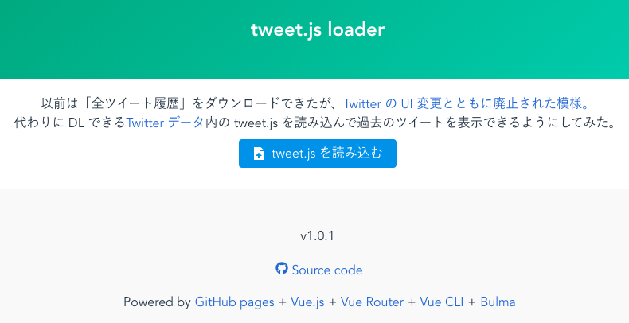

# [tweet.js loader](https://17number.github.io/tweet-js-loader/)

[Twitter データ](https://twitter.com/settings/your_twitter_data) から DL できる `tweet.js` を読み込んで過去のツイートを表示する。

以前は「全ツイート履歴」をダウンロードできたが、[Twitter の UI 変更とともに廃止された模様](https://twitter.com/sugtao4423/status/1185464513945980928)。

## Version History

### 1.0.4

- [Google Analytics](https://marketingplatform.google.com/intl/ja/about/analytics/) 追加
- [プライバシーポリシー](https://17number.github.io/tweet-js-loader/privacy)追加

### 1.0.3

- OGP 設定

### 1.0.2

- CSV ダウンロード機能の追加
  - `tweet_id`
  - `timestamp`
  - `full_text`

### 1.0.1

- フッター追加

### 1.0.0

- リリース

## スクリーンショット

## 紹介記事

- [Twitterデータのtweet\.jsを読み込んで過去ツイを表示するツール「tweet\.js loader」の紹介](https://r17n.page/2019/10/22/tweet-js-loader-introduction/)
- [Twitterデータのtweet\.jsを読み込んで過去ツイを表示するツール「tweet\.js loader」の技術面](https://r17n.page/2019/10/22/tweet-js-loader-tech/)
